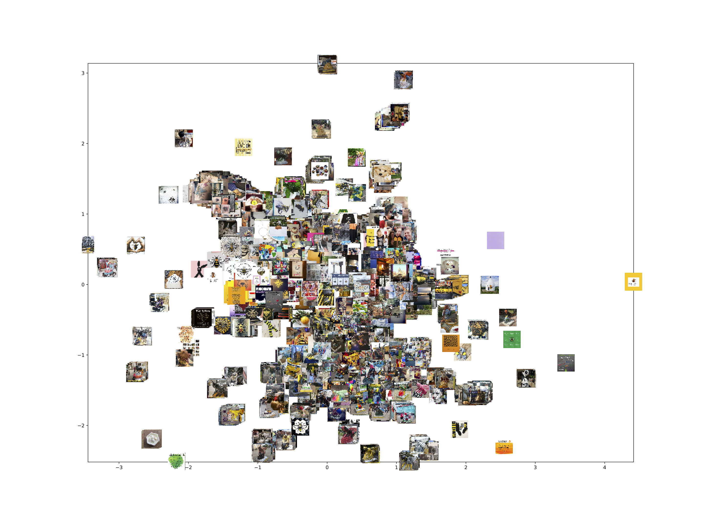

# manchesterbee 🐝

This repository accompanies the paper *\<title>* by [Samuel Merrill](https://) and [Simon Lindgren](https://), doi:().

#### Paper abstract
> At 10.31 pm on 22 May 2017 a bomb detonated in the Manchester Arena after an Ariana Grande concert. It killed 22 concertgoers and injured over 800 more. The worst terror attack in the UK since the 7 July 2005 London bombings, it triggered a massive public response leading to, among other things, improvised memorials, spontaneous vigils, dedicated hashtags, and viral videos. It also sparked the memetic reinvigoration and, subsequently, brandification of one of Manchester’s civic symbols: the worker bee. 

> This article explores the politics of post-terror togetherness through an analysis of the memetic spread and brand adoption of the worker bee after the 22 May 2017 Manchester bombing. Reconceptualising memes as ‘more or less digital’, the article ‘follows’ the bee across bodies, streets and social media platforms via the computational and interpretive analysis of approximately 53,000 Instagram images. It shows how the initial memeification of the bee carried with it grassroots expressions of togetherness while, at the same time, highlighting the elasticity of the bee’s meaning. Thereafter the article highlights the bee’s official brandification created but also obfuscated various political tensions. 

> Beyond empirically explicating the relationship between memes and brands in connection to the politics of post-terror togetherness, the article thus makes two broader contributions. First, in terms of its reconceptualization of memes with regards their ‘more or less digital’ composition, and second, in demonstrating one hybrid method for ‘following’ memes suited to this conceptualization. Both contributions have broader significance for future studies of memes. 

----

#### img2vec
As stated in the article (p. X), "we used a machine learning method image classification, through img2vec ([He et al 2018](https://link.springer.com/chapter/10.1007/978-981-13-2203-7_16)), in order to get an overview of clusters of similar images posted during each interval".'

The img2vec technique starts with extracting a feature vector per image in a dataset. The feature vector is a vector which contains a set of elements (features) that represents the image, its pixels and objects, in terms of for example colour, length, area, circularity, gradient magnitude, gradient direction, grey level, etc. The feature vector is a dense numerical representation of the input image, and it can be used for tasks such as comparing, ranking, classifying and clustering images. Once we have the image vector, we can treat it as we do words in word2vec models, to e.g find nearest neighbours in the embedding space, and to visualise relations between clusters/categories.

The actual implementation of the method in this case used feature extraction with [Keras](https://github.com/keras-team/keras), a deep learning API written in Python, running on top of the open-source machine learning platform [TensorFlow](https://www.tensorflow.org/). The method used here uses [the ResNet50 model](https://keras.io/api/applications/) which was pre-trained on [ImageNet](http://www.image-net.org/). 

This was followed by dimensionality reduction with [PCA](https://scikit-learn.org/stable/modules/generated/sklearn.decomposition.PCA.html#sklearn.decomposition.PCA) and [umap-learn](https://umap-learn.readthedocs.io/en/latest/index.html). 

#### plots
2d image maps were plotted with [matplotlib](https://matplotlib.org/).

Interval (click # to view)|Date range|Number of images|
---:|:---|---:|
[#1](https://github.com/simonlindgren/manchesterbee/blob/main/imagemaps/mcb_int1.png)|23/04/2017 – 23/07/2017|7247
[#2](https://github.com/simonlindgren/manchesterbee/blob/main/imagemaps/mcb_int2.png)|24/07/2017 – 23/10/2017|4676
[#3](https://github.com/simonlindgren/manchesterbee/blob/main/imagemaps/mcb_int3.png)|24/10/2017 – 23/01/2018|3798
[#4](https://github.com/simonlindgren/manchesterbee/blob/main/imagemaps/mcb_int4.png)|24/01/2018 – 23/04/2018|3957
[#5](https://github.com/simonlindgren/manchesterbee/blob/main/imagemaps/mcb_int5.png)|24/04/2018 – 23/07/2018|11085
[#6](https://github.com/simonlindgren/manchesterbee/blob/main/imagemaps/mcb_int6.png)|24/07/2018 – 23/10/2018|22211
[all](https://github.com/simonlindgren/manchesterbee/blob/main/imagemaps/mcb_all.png)|23/04/2017 – 23/10/2018|**52974**
[all-hiRes](https://github.com/simonlindgren/manchesterbee/blob/main/imagemaps/mcb_all_hiRes.png)

